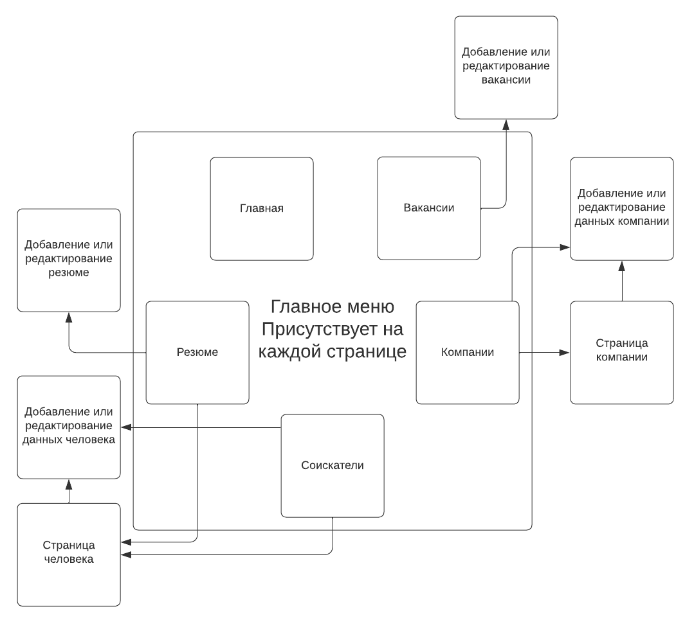
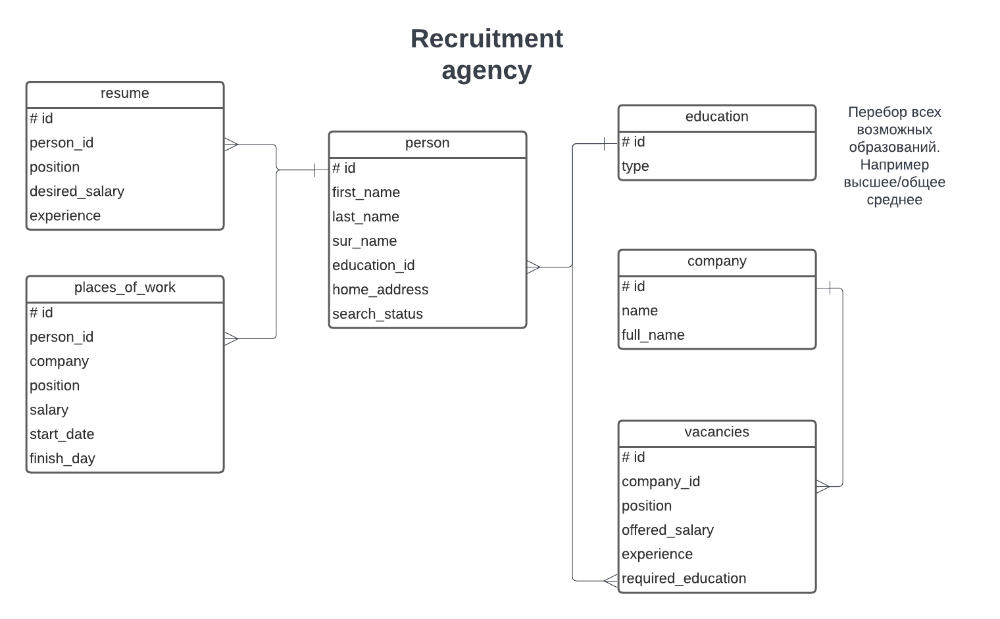

# WEB-Практикум
Практикум 3 курса 2 семестра ВМК МГУ Ковтуна Данилы.
*****
## Вариант №7 Кадровое агентство
Разработанное веб-приложение будет использоваться для сопровождения работы кадрового агенства

### Описание страниц

На диаграмме представлен список страниц с возможными переходами между ними. На каждой странице есть одноуровневое меню, состоящее из пяти ссылок: Главная, Вакансии, Резюме, Соискатели, Компании.

#### Главная
При заходе на сайт, первым делом попадаешь на главную страницу. На ней содержится общая информация о системе, текст с описанием проекта.

#### Вакансии
Список вакансий в виде таблицы.

В поля этой таблицы входят:
- Компания (клибкабельно, при нажатии переходит на страницу работодателя)
- должность
- предлагаемая зарплата
- требования к образованию
- Желательный опыт работы
- Кнопка ***Подходящие резюме*** под эту вакансию (кликабельно). При нажатии переходит на страницу ***Резюме*** с подходящими резюме
- Кнопка ***Удалить вакансию***
- Кнопка ***Редактировать вакансию***. Переход на страницу ***Добавление или редактирование данных компании***.

Над таблицей присутсвует кнопка ***Добавить вакансию***, при нажатии переход на страницу ***Добавление или редактирование данных компании*** со всеми пустыми полями. Доступна фильтрация по компаниям, должностям, зарплатам, образованию, опыту работы.

#### Соискатели
Список всех соискателей в строчку:
- Фамилия Имя Отчество (кликабельно). При нажатии переходит на личную страницу человека.

Над списком присутсвует кнопка ***Добавить соискателя***. По ней осуществляется переход на страницу редактирования/добавления данных о человеке. Доступна фильтрация по ФИО

#### Резюме
Список всех резюме в виде таблицы. Является дополненной информацией страницы ***Соискатели***, и отражает вакансии людей, у которых статус: ***Ищет работу***.

В поля таблицы входят:
- Фамилия Имя Отчество (кликабельно). При нажатии переходит на личную страницу человека.
- Должность
- Желаемая Зарплата
- Опыт работы
- Образование
- Кнопка ***Подходящие вакансии*** (кликабельно). При нажатии переходит на страницу ***Вакансии*** с уже отфильтрованными вакансиями
- Кнопка ***Удалить резюме***
- Кнопка ***Редактировать резюме***. Переход на страницу редактирования/добавления.

Над таблицей присутсвует кнопка ***Добавить резюме***, переход на страницу редактирования/добавления. Доступна фильтрация по фио, образованию, по должностям, зарплатам, опыту работы

#### Компании
Список всех работодателей в строчку:
- Название компании (клибкабельно, при нажатии переходит на ***страницу работодателя***)

Над списком присутсвует кнопка ***Добавить компанию***, переход на страницу редактирования/добавления. Доступна фильтрация по названию компании

#### Страница человека
На каждой строке по очереди выводятся следующие данные:
- Фамилия
- Имя
- Отчество
- Образование
- Домашний адрес
- История работы: компании, должности (обязанности), зарплаты, период времени работы
- Статус: ищет работу или нет.
- Кнопка ***Все резюме*** (кликабельно). При нажатии переходит на страницу ***Резюме*** со всеми резюме выбранного человека
- Кнопка ***Удалить данные о человеке*** (Удаляет также все резюме этого человека)
- Кнопка ***Редактировать данные***. Переход на страницу редактирования/добавления.

#### Страница работодателя
На каждой строке по очереди выводятся следующие данные:
- "Краткое имя компании"
- "Полное имя компании"
- Кнопка ***Все вакансии компании*** (кликабельно). При нажатии переходит на страницу ***Вакансии*** с вакансиями этой копмании
- Кнопка ***Удалить данные о компании*** (Удаляет также вакансии этой компании)
- Кнопка ***Редактировать данные***. Переход на страницу редактирования/добавления.

#### Страница редактирование или добавления ...
Все подобные страницы имеют схожий интерфейс. Имеет вид таблицы n\*2. Левый столбец - названия полей, справа - данные, которые необходимо добавить/изменить. Также есть кнопка ***Сохранить*** и ***Отмена***, которая сохраняет все изменения и переводит в один из пунктов меню, в зависимости от того, что редактировалось.

### Некоторые сценарии использования
- получить список вакансий, в т.ч. отфильтровав по указанным критериям (по компаниям, должностям, зарплатам): Главная -> Вакансии -> (выбрать необходимые фильтры) -> Применить фильтры
- Получить список резюме для конкретной вакансии: Главная -> Вакансии -> (выбрать необходимые фильтры чтобы найти эту вакансии) -> Применить фильтры -> Нажать кнопку ***Подходящие резюме***.
- получить список резюме, в т.ч. отфильтровав по указанным критериям (по образованию, по должностям, зарплатам): Главная -> Резюме -> (выбрать необходимые фильтры) -> Применить фильтры
- Получить список вакансий для конкретного резюме: Главная -> Резюме -> (выбрать необходимые фильтры чтобы найти это резюме) -> Применить фильтры -> Нажать кнопку ***Подходящие вакансии***.
- Получение истории работы для данного человека: Главная -> Соискатели -> фильтр по ФИО -> применить -> Нажать на ФИО нужного человека (переход на страницу человека) -> см. поле история работы
- Удаление данных о человеке: Главная -> Соискатели -> фильтр по ФИО -> Применить -> Нажать на ФИО нужного человека (переход на страницу человека) -> Кнопка ***Удалить данные о человеке***
- Аналогично для редактирования данных о человеке, только вместо кнопки ***удалить*** нажать кнопку ***редактировать***. После этого отредактировать данные и нажать кнопку ***Сохранить***
- Добавление компании: Главная -> Компании -> кнопка ***добавить компанию***
- Изменение данных компании: Главная -> Компании -> фильтр по названию компании -> Применить -> Нажать на название компании (переход на страницу работодателя) -> нажать кнопку ***Редактировать данные*** (Переход на страницу редактирования данных) -> Непосредственно изменение -> Кнопка ***Сохранить***
- Добавление соискателя: Главная -> Соискатели -> кнопка ***добавить соискателя***
- Изменить вакансию: Главная -> Вакансии -> (выбрать необходимые фильтры чтобы найти эту вакансии) -> Применить фильтры -> Нажать кнопку ***Редактировать вакансию*** -> Написать изменению в нужных полях -> кнопка ***Сохранить***
- Изменить резюме: Главная -> Резюме -> (выбрать необходимые фильтры чтобы найти это резюме) -> Применить фильтры -> Нажать кнопку ***Редактировать резюме*** -> Написать изменению в нужных полях -> кнопка ***Сохранить***

### База данных

